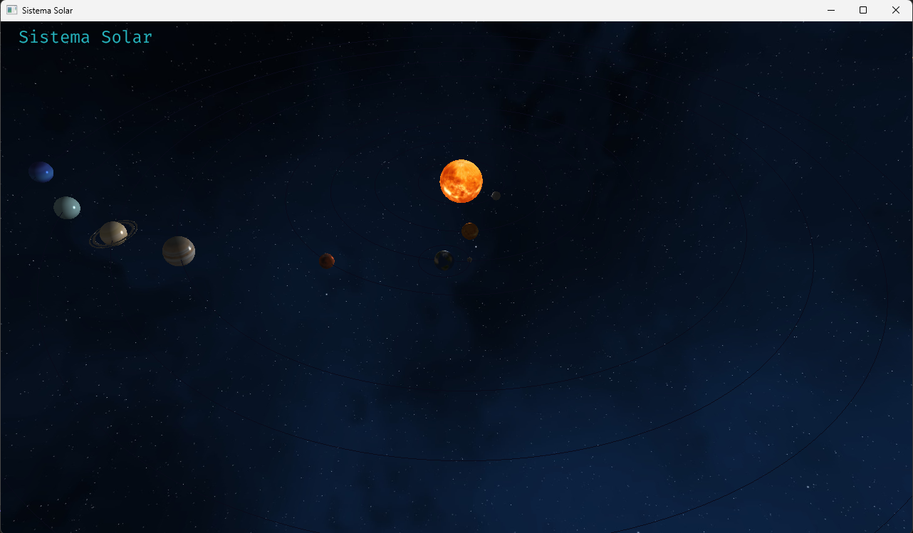
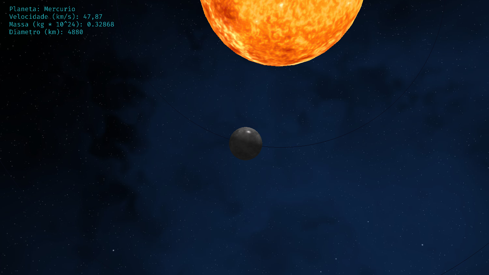
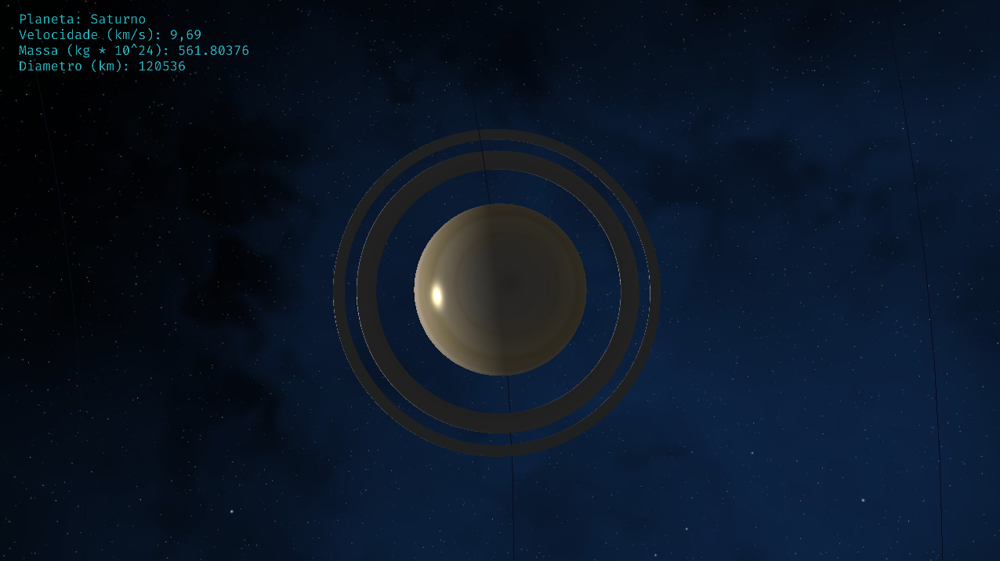

# Sistema Solar OpenGL

### Trabalho realizado por: Diogo, Luís, Tiago, Nelson
### Cadeira: Computação Gráfica
### Universidade: UBI

## Descrição do Trabalho
Este é um trabalho em OpenGL que consiste em um sistema solar. O código carrega modelos de objetos 3D para representar os planetas e as suas respectivas órbitas. Além disso, o código também carrega texturas para aplicar nas superfícies dos planetas e uma cubemap para criar um céu estrelado.

As informações sobre os caminhos para os modelos de objetos, texturas e cubemap são armazenadas em variáveis de caminho, como "sol_path", "mercurio_path" e "sky_path".

O código também gera vetores com a posição de cada órbita dos planetas e cria VAOs e VBOs para desenhar essas órbitas. Além disso, o código usa shaders para desenhar os planetas e o céu estrelado.

O código também utiliza a biblioteca FreeType para escrever texto na janela do programa. A biblioteca FreeType é uma biblioteca de software livre que permite que o código carregue e renderize fontes TrueType. Isso é útil para exibir informações adicionais na tela, como nomes de planetas ou informações sobre as órbitas.

## Exemplos
Visão Geral do sistema solar

Visão do Planeta mercúrio

Visão de Saturno
